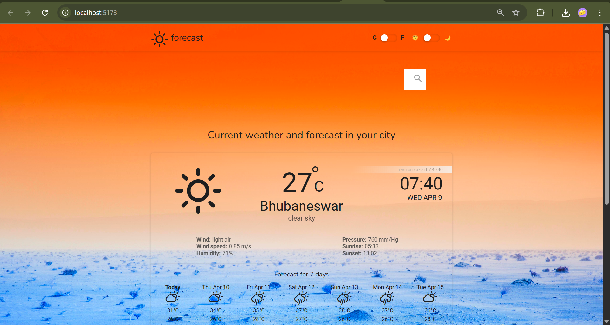
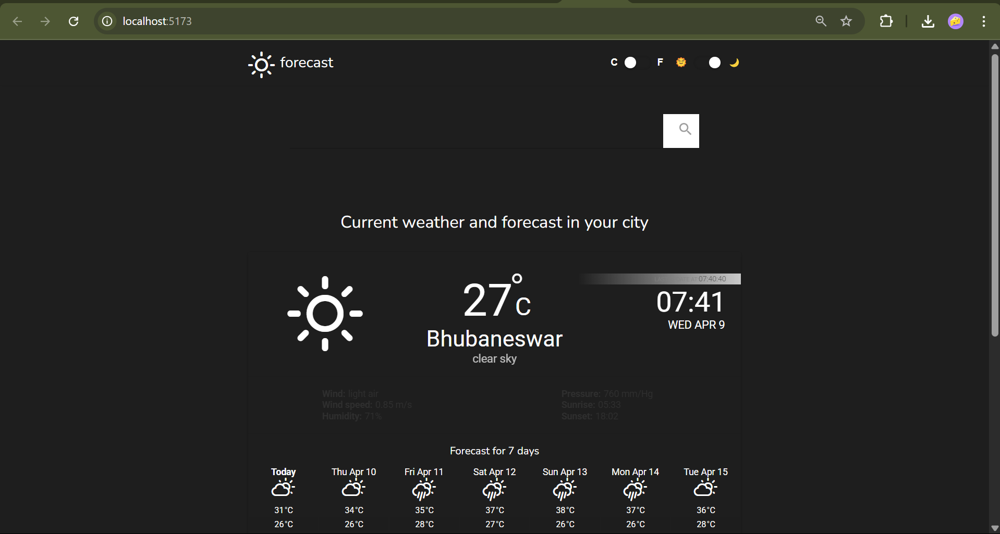

# 🌦 Weather Forecast Dashboard  
### Hi, This is Manish Kumar

It is a responsive and modern **Weather Dashboard Web App** built using **React.js** that allows users to search for any city and view **live weather** information and **7-day forecasts** using the OpenWeatherMap API.

This project was created to demonstrate skills in:
- Modular and clean React code
- API integration and dynamic data rendering
- Graceful handling of loading & error states
- Building responsive UIs with theming options
- Deployment of a full-stack-ready web app

---

## 📸 Preview

---

## 🕒 Timeline

This project was developed and submitted within **12 hours** as part of an assignment challenge.

---

## 🔧 Features

### ✅ Core Features
- 🔍 Search any city to fetch live weather
- 🌤 Displays:
  - City name
  - Current temperature (°C/°F)
  - Weather condition and icon
  - Wind speed, humidity, pressure
  - Sunrise and sunset time
- 🌡 Toggle between **Celsius (°C)** and **Fahrenheit (°F)**
- 🌗 Light / Dark **theme toggle**
- 🧭 Real-time API integration with **OpenWeatherMap**
- 🧊 Graceful loading & error handling UI

### 🌟 Bonus Features
- 🕰 **7-Day Forecast** using One Call API
- 🌓 **Theme Toggle** using `context API` and `Switcher` component
- 🔄 Real-time refresh option
- 🔁 Potential for **Recent Searches** (ready for enhancement)
- 💫 Clean transitions and animations via CSS

---

## 🖥 Tech Stack

- ⚛ React.js (Vite)
- 🧠 Context API (global state)
- 💅 SCSS Modules
- 📦 Axios / Fetch API
- 🌍 OpenWeatherMap API
- 🎨 Framer Motion (optional animation-ready)

---

## 🚀 Getting Started

### 1. Clone the repo

git clone https://github.com/kmanishprogrammar/Zynetic-Assignment.git
cd WEATHER-APP-REACT

### 2. Install dependencies
npm install

### 3. Edit the API Key
Modify the API at src\modules\api\config.ts

### 4. Run the dev server
npm run dev

---

## 🔌 API Usage

### 📍 Current Weather API

https://api.openweathermap.org/data/2.5/weather?q={city}&appid={API_KEY}&units=metric

### 📍 7-Day Forecast API (via One Call API)

https://api.openweathermap.org/data/2.5/onecall?lat={lat}&lon={lon}&exclude=minutely,hourly,alerts&appid={API_KEY}&units=metric

---

## 📄 License

MIT License. Free for personal and educational use.

---

## 👤 Author

Manish Kumar 
GitHub: [https://github.com/kmanishprogrammar]

---
